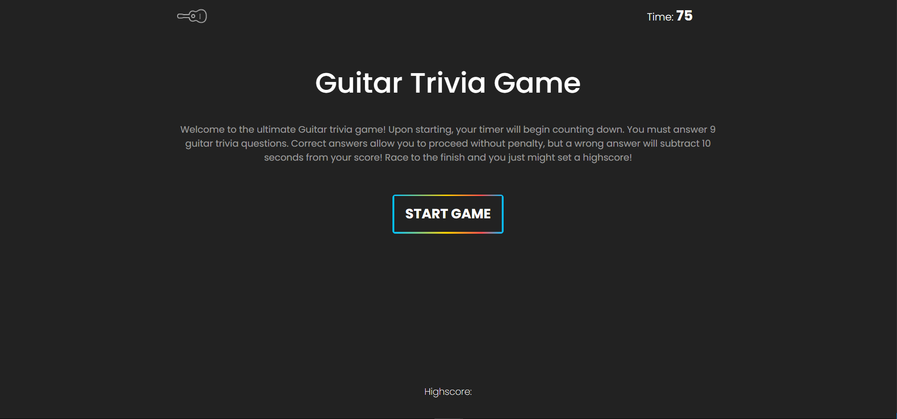

# hw-week-four

## Description
This project is a simple trivia game in which the user plays a timed game in which they must answer various guitar-related trivia questions. This project utilizes many aspects of JavaScript and Jquery, such as event listeners, local data, game logic, and local APIs.

Live deployment of this project can be viewed at: https://jaymanw.github.io/hw-week-four/